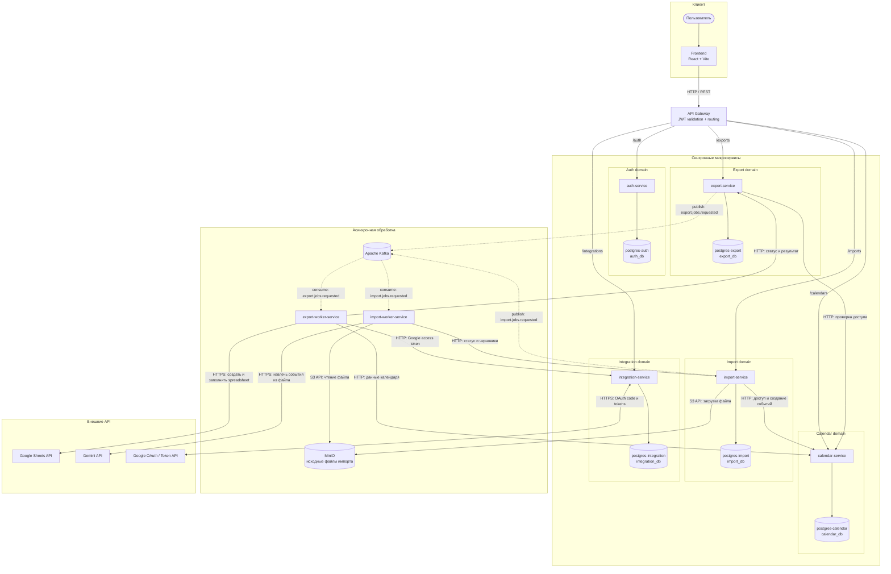

# Sports Calendar

Backend project для планирования спортивного календаря соревнований и экспорта календаря в Google Sheets.

Проект позволяет:

- регистрировать пользователей и авторизовываться;
- создавать спортивные календари по виду спорта и году;
- добавлять соревнования с датами, уровнем, местом, ссылкой, дисциплинами и приоритетом;
- просматривать события с фильтрацией, поиском, сортировкой и пагинацией;
- создавать новый календарь из отфильтрованной выборки событий;
- подключать Google account через OAuth;
- асинхронно экспортировать календарь в Google Sheets;
- проверять API через простой frontend.

## Стек

- Java 21
- Spring Boot 3
- Spring Security
- Spring Data JPA
- PostgreSQL
- Flyway
- Kafka
- Docker Compose
- Maven
- Frontend: Vite, React, TypeScript, CSS

## Архитектура



Сплошные стрелки показывают синхронные HTTP/S3-вызовы и доступ к данным, пунктирные — публикацию асинхронных задач в Kafka. Каждый stateful-сервис владеет собственной PostgreSQL БД. Во время подключения Google frontend получает `redirectUrl` через `api-gateway` и перенаправляет браузер пользователя на consent screen; callback возвращается браузером через `api-gateway` в `integration-service`.

Снаружи публикуются:

| Service | URL |
| --- | --- |
| Frontend | `http://localhost:5173` |
| API Gateway | `http://localhost:8080` |

Остальные backend-сервисы доступны только внутри Docker network.

## Сервисы

### api-gateway

Единая HTTP-точка входа.

Отвечает за:

- проксирование запросов во внутренние сервисы;
- проверку JWT access token для защищённых маршрутов;
- удаление входящего `X-User-Id` от клиента;
- установку доверенного `X-User-Id` на основе JWT;
- CORS для браузерного frontend.

Маршрутизация:

| Gateway path | Target service | Auth |
| --- | --- | --- |
| `/auth/**` | `auth-service` | public |
| `/calendars/metadata` | `calendar-service` | public |
| `/calendars/**` | `calendar-service` | Bearer JWT |
| `/exports/**` | `export-service` | Bearer JWT |
| `/imports/**` | `import-service` | Bearer JWT |
| `/integrations/google/callback` | `integration-service` | public |
| `/integrations/**` | `integration-service` | Bearer JWT |

### auth-service

Отвечает за:

- регистрацию;
- login;
- BCrypt-хэширование паролей;
- выпуск JWT access token;
- выпуск opaque refresh token;
- хранение SHA-256 hash refresh token в БД;
- refresh token rotation;
- logout с отзывом refresh token.

Access token возвращается в JSON. Refresh token возвращается в `HttpOnly` cookie:

```http
Set-Cookie: refresh_token=...; Path=/auth; HttpOnly; SameSite=Lax
```

Важно: logout отзывает refresh token, но уже выданный access token остаётся валидным до истечения срока жизни.

### calendar-service

Отвечает за календари и соревнования.

Основные классы:

| Class | Responsibility |
| --- | --- |
| `CalendarService` | CRUD календарей и проверка владельца |
| `EventService` | CRUD событий, фильтрация, пагинация, сортировка |
| `CalendarCopyService` | создание нового календаря из выборки событий |
| `CalendarExportService` | подготовка данных календаря для экспорта |
| `CalendarMetadataService` | справочники enum для frontend |
| `CalendarSpecifications`, `EventSpecifications` | динамические JPA-фильтры |
| `SortParser` | безопасный разбор параметра `sort` |

### integration-service

Отвечает за Google OAuth:

- создание Google OAuth URL;
- обработка callback;
- хранение подключённого Google account;
- шифрование Google refresh token;
- выдача short-lived Google access token внутренним сервисам;
- отключение интеграции.

### export-service

Отвечает за export job:

- создаёт задачу экспорта;
- проверяет доступ пользователя к календарю;
- хранит статус задачи;
- публикует событие в Kafka topic `export.jobs.requested`;
- принимает internal callbacks от worker;
- отдаёт клиенту статус экспорта.

Статусы:

```text
PENDING
PROCESSING
SUCCESS
FAILED
```

### export-worker-service

Отдельный worker:

- слушает Kafka topic `export.jobs.requested`;
- получает данные календаря из `calendar-service`;
- получает Google access token из `integration-service`;
- создаёт Google Spreadsheet;
- записывает события календаря в Google Sheets;
- сообщает результат в `export-service`.

### import-service

Отвечает за импорт событий из файлов:

- принимает файл от frontend через `POST /imports`;
- проверяет доступ пользователя к календарю;
- сохраняет оригинальный файл в MinIO;
- создаёт import job;
- публикует событие в Kafka topic `import.jobs.requested`;
- хранит черновики найденных событий;
- позволяет посмотреть, отредактировать или удалить черновые события;
- применяет импорт, создавая настоящие события в `calendar-service`.

Файл не сохраняется в БД. В БД хранится только `objectKey` файла в MinIO.

Статусы:

```text
PENDING
PROCESSING
READY
APPLIED
FAILED
```

### import-worker-service

Для `xlsx` и `csv` worker не отправляет весь файл в модель одним большим запросом. Сначала файл превращается в строки таблицы, затем строки делятся на пачки. Каждая пачка обрабатывается моделью отдельно, результаты объединяются, а одинаковые события удаляются по ключу `title + startDate + endDate + location`.

Размер пачки настраивается:

```text
IMPORT_TABLE_CHUNK_ROW_COUNT=10
IMPORT_TEXT_CHUNK_LINE_COUNT=80
IMPORT_FAILED_TEXT_CHUNK_LINE_COUNT=20
IMPORT_PDF_MIN_TEXT_CHARS=40
IMPORT_PDF_IMAGE_DPI=150
```

Если локальная модель пропускает события, отвечает нестабильно или Ollama пишет `truncated = 1`, можно уменьшить значение до `5`-`8`. Если модель работает уверенно и хочется меньше запросов к Ollama, можно увеличить до `15`-`20`.

Если отдельный text chunk вернулся от модели в невалидном формате, worker не валит импорт сразу: он разбивает этот chunk на меньшие части по `IMPORT_FAILED_TEXT_CHUNK_LINE_COUNT` строк и повторяет обработку.

PDF обрабатывается постранично:

- если на странице есть достаточно извлекаемого текста, вся страница обрабатывается как один text chunk;
- если текста почти нет, страница считается сканом/картинкой, рендерится в PNG и отправляется в vision-модель;
- смешанные PDF тоже поддерживаются: текстовые страницы идут в text-модель, страницы-сканы — в vision-модель.

Фоновый worker для тяжёлой обработки импортов:

- слушает Kafka topic `import.jobs.requested`;
- скачивает файл из MinIO;
- извлекает данные из `xlsx`, `csv`, `txt`, текстового `pdf`;
- для изображений (`png`, `jpg`, `webp`) отправляет файл в vision-модель;
- отправляет текст/табличное представление в локальную Ollama-модель;
- получает JSON со списком событий;
- возвращает результат в `import-service` через internal HTTP callback.

По умолчанию используются локальные модели:

```text
OLLAMA_TEXT_MODEL=qwen2.5:3b
OLLAMA_VISION_MODEL=qwen2.5vl:3b
```

Модели можно заменить через env-переменные без изменения кода.

## Доменная модель

### Calendar

| Field | Description |
| --- | --- |
| `id` | id календаря |
| `ownerId` | id пользователя-владельца |
| `name` | название календаря |
| `sportType` | вид спорта |
| `year` | год календаря |
| `createdAt` | дата создания |
| `updatedAt` | дата последнего обновления |

### Event

| Field | Description |
| --- | --- |
| `id` | id события |
| `calendarId` | id календаря |
| `title` | название соревнования |
| `startDate` | дата начала |
| `endDate` | дата окончания |
| `competitionLevel` | enum-код уровня соревнования |
| `competitionLevelTitle` | русское название уровня |
| `location` | место проведения |
| `externalUrl` | ссылка на сайт/регистрацию |
| `disciplines` | список дисциплин |
| `priority` | enum-код приоритета |
| `priorityTitle` | русское название приоритета |
| `createdAt` | дата создания |
| `updatedAt` | дата последнего обновления |

Однодневное соревнование хранится так:

```text
startDate = 2027-05-18
endDate   = 2027-05-18
```

Если при создании события `endDate` не передан, backend использует `startDate`.

## Enum-значения

### CompetitionLevel

| Code | Русское название |
| --- | --- |
| `INTERNATIONAL` | международные |
| `NATIONAL` | всероссийские |
| `REGIONAL` | региональные |
| `LOCAL` | местные |
| `TRAINING` | тренировочные |
| `OTHER` | другое |

Если `competitionLevel` не передан при создании события, используется `OTHER`.

### EventPriority

| Code | Русское название |
| --- | --- |
| `REQUIRED` | обязательный |
| `IMPORTANT` | важный |
| `OPTIONAL` | необязательный |

Если `priority` не передан при создании события, используется `OPTIONAL`.

## Локальный запуск

Скопировать переменные окружения:

```bash
cp .env.example .env
```

Для запуска без реального Google export можно оставить Google-переменные тестовыми. В этом случае приложение поднимется, но экспорт в Google Sheets работать не будет.

Для рабочего Google export нужно заполнить:

```text
GOOGLE_OAUTH_CLIENT_ID
GOOGLE_OAUTH_CLIENT_SECRET
GOOGLE_OAUTH_REDIRECT_URI=http://localhost:8080/integrations/google/callback
INTEGRATION_TOKEN_ENCRYPTION_SECRET
```

`JWT_SECRET` должен быть не короче 32 ASCII-символов, иначе `auth-service` и `api-gateway` не стартуют.

Запуск:

```bash
docker compose up --build
```

Перед первым импортом через локальную модель нужно скачать модели в контейнер Ollama:

```bash
docker compose --profile ollama up -d ollama
docker compose exec ollama ollama pull qwen2.5:3b
docker compose exec ollama ollama pull qwen2.5vl:3b
```

Если хочешь использовать локальный Ollama-провайдер, включи его явно:

```text
IMPORT_AI_PROVIDER=ollama
COMPOSE_PROFILES=ollama
```

Если локальная модель работает слишком медленно, можно переключить `import-worker-service` на Gemini API:

```text
IMPORT_AI_PROVIDER=gemini
COMPOSE_PROFILES=
GEMINI_API_KEY=your-google-ai-studio-api-key
GEMINI_BASE_URL=https://generativelanguage.googleapis.com
GEMINI_MODEL=gemini-3.6-flash
GEMINI_REQUEST_TIMEOUT_SECONDS=180
```

Ключ можно получить в Google AI Studio: открыть `https://aistudio.google.com/app/apikey`, войти в Google-аккаунт и создать API key. После изменения `.env` нужно пересобрать worker:

```bash
docker compose up -d --build import-worker-service
```

При `IMPORT_AI_PROVIDER=gemini` скачивать модели в Ollama не нужно. Если Gemini API недоступен из-за сети/VPN, можно вернуть `IMPORT_AI_PROVIDER=ollama`.

Если vision-модель окажется слишком тяжёлой для ноутбука, можно временно не использовать импорт изображений или заменить модель через `OLLAMA_VISION_MODEL`.

Открыть frontend:

```text
http://localhost:5173
```

Gateway:

```text
http://localhost:8080
```

### Порты

| Service | Internal port | Published port |
| --- | --- | --- |
| frontend | `5173` | `5173` |
| api-gateway | `8080` | `8080` |
| auth-service | `8081` | - |
| calendar-service | `8082` | - |
| export-service | `8083` | - |
| export-worker-service | `8084` | - |
| integration-service | `8085` | - |
| import-service | `8086` | - |
| import-worker-service | `8087` | - |
| postgres-auth | `5432` | `5433` |
| postgres-calendar | `5432` | `5434` |
| postgres-export | `5432` | - |
| postgres-import | `5432` | - |
| postgres-integration | `5432` | - |
| kafka | `9092` | - |
| minio | `9000` | `9000` |
| minio-console | `9001` | `9001` |
| ollama | `11434` | `11434` |

## Frontend

Frontend находится в:

```text
frontend/
```

Запуск вместе со всем проектом:

```bash
docker compose up --build
```

Запуск frontend отдельно при уже поднятом backend:

```bash
cd frontend
npm install
npm run dev
```

Frontend по умолчанию ходит в gateway:

```text
http://localhost:8080
```

Адрес gateway можно изменить через:

```text
VITE_API_BASE_URL=http://localhost:8080
```

Так как refresh token хранится в cookie, frontend отправляет запросы с:

```js
credentials: "include"
```

Gateway разрешает CORS для origin из переменной:

```text
CORS_ALLOWED_ORIGINS=http://localhost:5173
```

## API

Все клиентские запросы идут через:

```text
http://localhost:8080
```

Для защищённых endpoint-ов нужен заголовок:

```http
Authorization: Bearer <accessToken>
```

### Auth

#### Register

```http
POST /auth/register
Content-Type: application/json
```

```json
{
  "email": "user@example.com",
  "password": "strong-password",
  "fullName": "Ivan Ivanov"
}
```

Ответ:

```json
{
  "id": "00000000-0000-0000-0000-000000000000"
}
```

#### Login

```http
POST /auth/login
Content-Type: application/json
```

```json
{
  "email": "user@example.com",
  "password": "strong-password"
}
```

Ответ body:

```json
{
  "accessToken": "jwt-access-token",
  "expiresIn": 900
}
```

Ответ headers:

```http
Set-Cookie: refresh_token=...; Path=/auth; HttpOnly; SameSite=Lax
```

#### Refresh

```http
POST /auth/refresh
```

Refresh token берётся из cookie `refresh_token`.

Ответ:

```json
{
  "accessToken": "new-jwt-access-token",
  "expiresIn": 900
}
```

Backend также выставляет новый refresh cookie.

#### Logout

```http
POST /auth/logout
```

Logout отзывает текущий refresh token и очищает cookie.

### Metadata

```http
GET /calendars/metadata
```

Endpoint публичный. Нужен frontend-у для отображения русских названий enum.

Ответ:

```json
{
  "competitionLevels": [
    {
      "code": "REGIONAL",
      "title": "региональные"
    }
  ],
  "priorities": [
    {
      "code": "REQUIRED",
      "title": "обязательный"
    }
  ]
}
```

### Calendars

#### Create calendar

```http
POST /calendars
Authorization: Bearer <accessToken>
Content-Type: application/json
```

```json
{
  "name": "Календарь 2027",
  "sportType": "лёгкая атлетика",
  "year": 2027
}
```

Ответ: `201 Created` + `CalendarResponse`.

#### List calendars

```http
GET /calendars
Authorization: Bearer <accessToken>
```

Query-параметры:

| Parameter | Example | Description |
| --- | --- | --- |
| `year` | `2027` | фильтр по году |
| `sportType` | `лёгкая атлетика` | точный фильтр по виду спорта без учёта регистра |
| `search` | `атлетика` | поиск по названию календаря и виду спорта |
| `sort` | `updated,desc` | сортировка |

Поддерживаемые sort-поля:

```text
updated
created
year
name
```

Примеры:

```http
GET /calendars?year=2027&sort=updated,desc
GET /calendars?search=атлетика&sort=name,asc
```

#### Get calendar

```http
GET /calendars/{calendarId}
Authorization: Bearer <accessToken>
```

Возвращает только календарь, без событий.

#### Update calendar

```http
PATCH /calendars/{calendarId}
Authorization: Bearer <accessToken>
Content-Type: application/json
```

```json
{
  "name": "Календарь 2027 — основная группа",
  "sportType": "лёгкая атлетика",
  "year": 2027
}
```

Все поля опциональные.

#### Delete calendar

```http
DELETE /calendars/{calendarId}
Authorization: Bearer <accessToken>
```

Удаление календаря также удаляет его события и дисциплины событий.

#### Copy calendar by event filters

```http
POST /calendars/{calendarId}/copies?from=2027-01-01&to=2027-12-31&competitionLevel=REGIONAL&priority=REQUIRED&search=Москва
Authorization: Bearer <accessToken>
Content-Type: application/json
```

Body описывает новый календарь:

```json
{
  "name": "Региональные обязательные старты 2027",
  "sportType": "лёгкая атлетика",
  "year": 2027
}
```

Query-параметры определяют, какие события копировать из исходного календаря:

| Parameter | Example | Description |
| --- | --- | --- |
| `from` | `2027-01-01` | копировать события, которые пересекаются с периодом начиная с этой даты |
| `to` | `2027-12-31` | копировать события, которые пересекаются с периодом до этой даты |
| `competitionLevel` | `REGIONAL` | фильтр по уровню соревнований |
| `priority` | `REQUIRED` | фильтр по приоритету |
| `search` | `Москва` | поиск по названию, месту и дисциплинам |

Копирование создаёт новый календарь и независимые копии событий с новыми `id`.

Ответ: `201 Created` + `CalendarResponse` нового календаря.

### Events

#### Create event

```http
POST /calendars/{calendarId}/events
Authorization: Bearer <accessToken>
Content-Type: application/json
```

```json
{
  "title": "Чемпионат области",
  "startDate": "2027-05-18",
  "endDate": "2027-05-20",
  "competitionLevel": "REGIONAL",
  "location": "Владимир",
  "externalUrl": "https://example.com/registration",
  "disciplines": [
    "800 м",
    "1500 м"
  ],
  "priority": "REQUIRED"
}
```

Для однодневного события можно не передавать `endDate`:

```json
{
  "title": "Контрольный старт",
  "startDate": "2027-06-01",
  "competitionLevel": "TRAINING",
  "priority": "OPTIONAL"
}
```

#### List events

```http
GET /calendars/{calendarId}/events
Authorization: Bearer <accessToken>
```

Query-параметры:

| Parameter | Example | Description |
| --- | --- | --- |
| `from` | `2027-05-01` | показать события, которые пересекаются с периодом начиная с этой даты |
| `to` | `2027-05-31` | показать события, которые пересекаются с периодом до этой даты |
| `competitionLevel` | `REGIONAL` | фильтр по уровню соревнований |
| `priority` | `REQUIRED` | фильтр по приоритету |
| `search` | `Москва` | поиск по названию, месту и дисциплинам |
| `page` | `0` | номер страницы, начиная с нуля |
| `size` | `20` | размер страницы, от 1 до 100 |
| `sort` | `date,asc` | сортировка |

Поддерживаемые sort-поля:

```text
date
title
priority
level
created
updated
```

Примеры:

```http
GET /calendars/{calendarId}/events?page=0&size=20&sort=date,asc
GET /calendars/{calendarId}/events?from=2027-05-01&to=2027-05-31
GET /calendars/{calendarId}/events?search=Москва&priority=REQUIRED
```

Ответ:

```json
{
  "content": [
    {
      "id": "00000000-0000-0000-0000-000000000000",
      "calendarId": "00000000-0000-0000-0000-000000000000",
      "title": "Чемпионат области",
      "startDate": "2027-05-18",
      "endDate": "2027-05-20",
      "competitionLevel": "REGIONAL",
      "competitionLevelTitle": "региональные",
      "location": "Владимир",
      "externalUrl": "https://example.com/registration",
      "disciplines": [
        "800 м",
        "1500 м"
      ],
      "priority": "REQUIRED",
      "priorityTitle": "обязательный",
      "createdAt": "2027-01-01T10:00:00Z",
      "updatedAt": "2027-01-01T10:00:00Z"
    }
  ],
  "page": 0,
  "size": 20,
  "totalElements": 1,
  "totalPages": 1,
  "last": true
}
```

#### Get event

```http
GET /calendars/{calendarId}/events/{eventId}
Authorization: Bearer <accessToken>
```

#### Update event

```http
PATCH /calendars/{calendarId}/events/{eventId}
Authorization: Bearer <accessToken>
Content-Type: application/json
```

```json
{
  "title": "Обновлённое название",
  "startDate": "2027-05-18",
  "endDate": "2027-05-19",
  "competitionLevel": "NATIONAL",
  "location": "Москва",
  "externalUrl": "https://example.com",
  "disciplines": [
    "10 км"
  ],
  "priority": "IMPORTANT"
}
```

Все поля опциональные.

#### Delete event

```http
DELETE /calendars/{calendarId}/events/{eventId}
Authorization: Bearer <accessToken>
```

### Google integration

#### Connect

```http
GET /integrations/google/connect
Authorization: Bearer <accessToken>
```

Ответ:

```json
{
  "redirectUrl": "https://accounts.google.com/o/oauth2/v2/auth?..."
}
```

Пользователь открывает `redirectUrl`, подтверждает доступ, после чего Google редиректит на:

```http
GET /integrations/google/callback?code=...&state=...
```

#### Status

```http
GET /integrations/google/status
Authorization: Bearer <accessToken>
```

Ответ:

```json
{
  "provider": "GOOGLE",
  "connected": true,
  "email": null,
  "scopes": "https://www.googleapis.com/auth/drive.file"
}
```

#### Disconnect

```http
DELETE /integrations/google
Authorization: Bearer <accessToken>
```

### Import

#### Create import job

```http
POST /imports
Authorization: Bearer <accessToken>
Content-Type: multipart/form-data
```

Multipart fields:

```text
calendarId = 00000000-0000-0000-0000-000000000000
file = calendar.xlsx
```

Ответ: `202 Accepted`

```json
{
  "jobId": "00000000-0000-0000-0000-000000000000",
  "calendarId": "00000000-0000-0000-0000-000000000000",
  "fileName": "calendar.xlsx",
  "status": "PENDING",
  "totalEvents": 0,
  "validEvents": 0,
  "invalidEvents": 0,
  "errorMessage": null
}
```

Поддерживаемые типы первой версии:

```text
xlsx, xls, csv, txt, pdf with text, png, jpg, jpeg, webp
```

#### Get import job

```http
GET /imports/{jobId}
Authorization: Bearer <accessToken>
```

#### Get draft events

```http
GET /imports/{jobId}/events
Authorization: Bearer <accessToken>
```

#### Update draft event

```http
PATCH /imports/{jobId}/events/{draftEventId}
Authorization: Bearer <accessToken>
Content-Type: application/json
```

```json
{
  "title": "Первенство области",
  "startDate": "2026-05-10",
  "endDate": "2026-05-12",
  "competitionLevel": "REGIONAL",
  "location": "Тверь",
  "externalUrl": null,
  "disciplines": ["800 м", "1500 м"],
  "priority": null
}
```

#### Delete draft event

```http
DELETE /imports/{jobId}/events/{draftEventId}
Authorization: Bearer <accessToken>
```

#### Apply import

```http
POST /imports/{jobId}/apply
Authorization: Bearer <accessToken>
```

Создаёт настоящие события в `calendar-service` только из валидных черновиков.

```json
{
  "createdEvents": 12
}
```

### Export

#### Create export job

```http
POST /exports
Authorization: Bearer <accessToken>
Content-Type: application/json
```

```json
{
  "calendarId": "00000000-0000-0000-0000-000000000000",
  "provider": "GOOGLE_SHEETS"
}
```

Ответ: `202 Accepted`

```json
{
  "jobId": "00000000-0000-0000-0000-000000000000",
  "provider": "GOOGLE_SHEETS",
  "status": "PENDING",
  "spreadsheetId": null,
  "spreadsheetUrl": null,
  "errorMessage": null
}
```

#### Get export job

```http
GET /exports/{jobId}
Authorization: Bearer <accessToken>
```

Успешный результат:

```json
{
  "jobId": "00000000-0000-0000-0000-000000000000",
  "provider": "GOOGLE_SHEETS",
  "status": "SUCCESS",
  "spreadsheetId": "google-spreadsheet-id",
  "spreadsheetUrl": "https://docs.google.com/spreadsheets/d/...",
  "errorMessage": null
}
```

## Google Sheets export flow

```text
Client
  -> GET /integrations/google/connect
  <- redirectUrl

User
  -> Google consent screen
  -> /integrations/google/callback

Client
  -> POST /exports
  <- 202 Accepted + jobId

Export Service
  -> Calendar Service: access-check
  -> Kafka: export.jobs.requested

Export Worker Service
  -> Calendar Service: export-data
  -> Integration Service: Google access token
  -> Google Sheets API: create spreadsheet
  -> Google Sheets API: write rows
  -> Export Service: SUCCESS / FAILED

Client
  -> GET /exports/{jobId}
  <- status + spreadsheetUrl
```

Если нужно экспортировать не весь календарь, а выборку событий:

```text
1. Отфильтровать события.
2. Создать новый календарь через POST /calendars/{calendarId}/copies.
3. Запустить обычный export для нового календаря.
```

## Тесты

Запуск всех тестов:

```bash
mvn test
```

Проверка как в CI:

```bash
mvn -B -U clean verify
```

Запуск только одного сервиса и зависимых модулей:

```bash
mvn -B -pl modules/calendar-service -am test
```

Frontend build:

```bash
cd frontend
npm install
npm run build
```

## CI

GitHub Actions workflow находится в:

```text
.github/workflows/ci.yml
```

CI запускается:

- при `push` в ветки `develop*` и `develop/**`;
- при `pull_request` в `main`, `develop*`, `develop/**`.

Команда CI:

```bash
mvn -B -U clean verify
```
